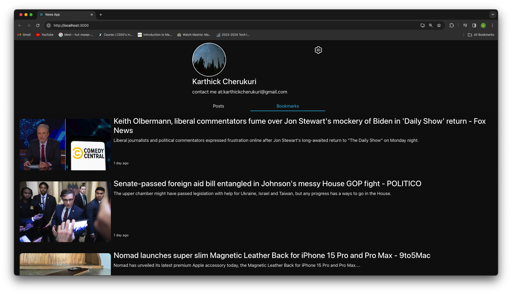

# NewsProfileApp

## Overview

This application is a comprehensive platform designed to provide users with a seamless experience for viewing posts and bookmarks. It is built with a focus on user-centric design and functionality.

## Live Application

Access the live application [here](link).

## Core Components

- **Posts**: Responsible for rendering the posts in both the bookmarks and posts tabs.
- **UserDetails**: Handles the display of user-specific details, including name, bio, and the settings button.
- **Tabsection**: Facilitates the switching between different tabs.

## Routing Structure

- Home Page: `/`
- Settings Page: `/settings`
- All Other Routes: NotFoundPage

## Getting Started

To run the application locally:

1. Clone the repository.
2. Install the necessary packages using `npm install`.
3. Start the server with `npm start`.

## Dependencies

- **React-hook-theme**: Used for implementing dark and light modes.
- **React-icon**: Facilitates the usage of icons.
- **React-loader-spinner**: Provides a loading spinner while data is being fetched.
- **React-router-dom**: Handles navigation within the application.

## Key Features

- **Dark Mode**: The default theme is set to match the system's default. Users can toggle between dark and light modes via the settings page.
- **NewsAPI Integration**: A loading spinner is displayed while data is being fetched. Upon successful data retrieval, posts and bookmarks are displayed. In case of failure (e.g., API limit exceeded), static data is displayed.

## Visual Overview

### Desktop View

### Mobile View

